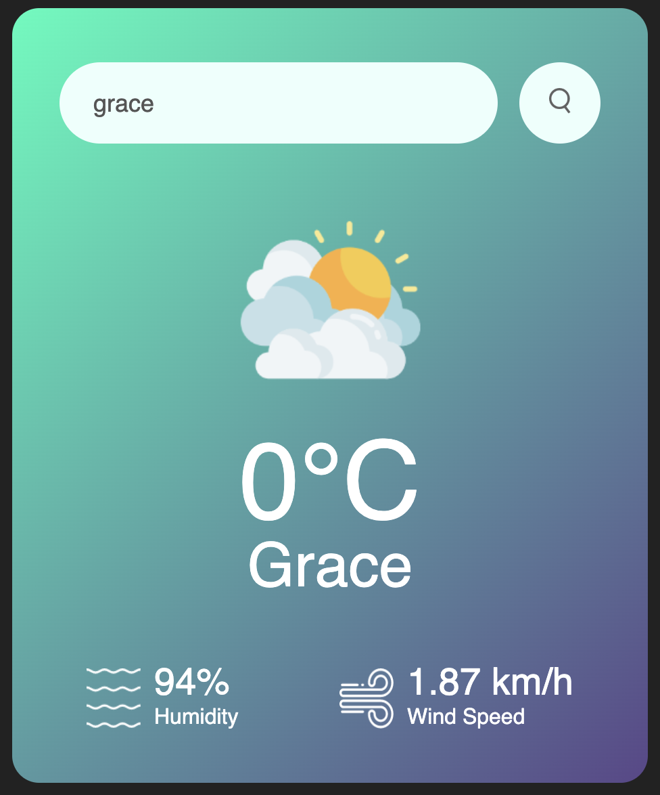
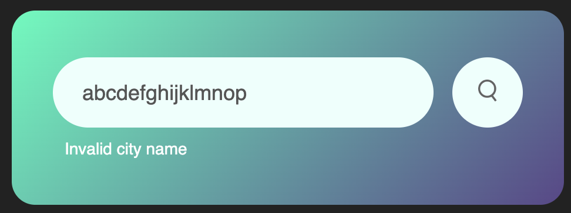

# weather-app

Basic weather app using HTML, CSS and JavaScript API call

## Results

Valid city searched using app: 

Invalid city searched using app: 

## Resources used:

- [Tutorial](https://www.youtube.com/watch?v=MIYQR-Ybrn4&list=PLjwm_8O3suyOgDS_Z8AWbbq3zpCmR-WE9&ab_channel=GreatStack)
- [OpenWeather API](https://openweathermap.org/api)
- [OpenWeather API Key](https://home.openweathermap.org/api_keys)

## Rose Bud Thorn Retrospective:

- Rose (What went well)

  - CSS formatting was easy to pick up and customise

- Bud (What has potential)

  - JavaScript querying and api usage was straightforward
  - Could search for other free api's to experiment with

- Thorn (What didn't work)

  - Need to brush up on console debugging
